# Parrot Gripper

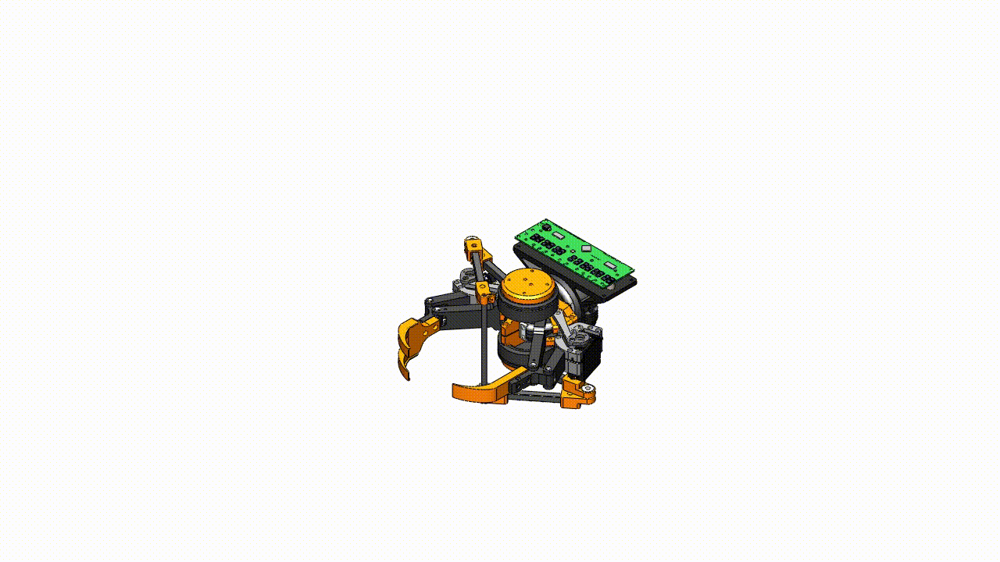 

## 1. Overview
The parrot gripper is a robotic end-effector that imitates the parrot's feeding apparatus with a pair of powerful beaks and a soft tongue. This end-effector is implemented by retrofitting an off-the-shelf industrial robotic gripper with customized hardware devices. The tongue (or palm) is a five-bar parallel manipulator that is direct-driven by two brushless gimbal motors, which can achieve force control, virtual compliance, and rapid motion. The beaks (or fingers) are actuated by two servo motors that morphs the adaptive linkages of the gripper.

This repository provides the details of assembling and controlling the parrot gripper.

**Related Patents:**
- K. H. Mak, Z. Yin, and J. Seo, "System and Method for Robotic In-Hand Manipulation," (Under preparation).

## 2. Bill of Materials

**SolidWorks Model**
<!--  - [**Version 1.0**](media/ParrotGripperV1.0_SolidWorks.zip)  -->
- <a id="raw-url" href="https://raw.githubusercontent.com/HKUST-RML/parrot_gripper/master/media/ParrotGripperV1.0_SolidWorks.zip">**Version 1.0**</a> (10 Nov. 2021)

**Actuators**
- [**Robotiq 2F-140**](https://robotiq.com/products/2f85-140-adaptive-robot-gripper): Adaptive Parallel Jaw Gripper x 1
- [**GB6010 gimbal motor**](https://www.aliexpress.com/i/10000018036119.html) x 2
- [**MG995 servo motor**](https://www.towerpro.com.tw/product/mg995/) x 2

**Electronics**
- [**Odrive v3.6**](https://odriverobotics.com/): brushless motor controller x 1
- [**AS5048A encoder**](https://ams.com/as5048a) x 2
- [**Arduino Micro**](https://store.arduino.cc/products/arduino-micro) x 1

## 3. Assembly Instructions

### 3.1 Assembling servo link to gripper bracket

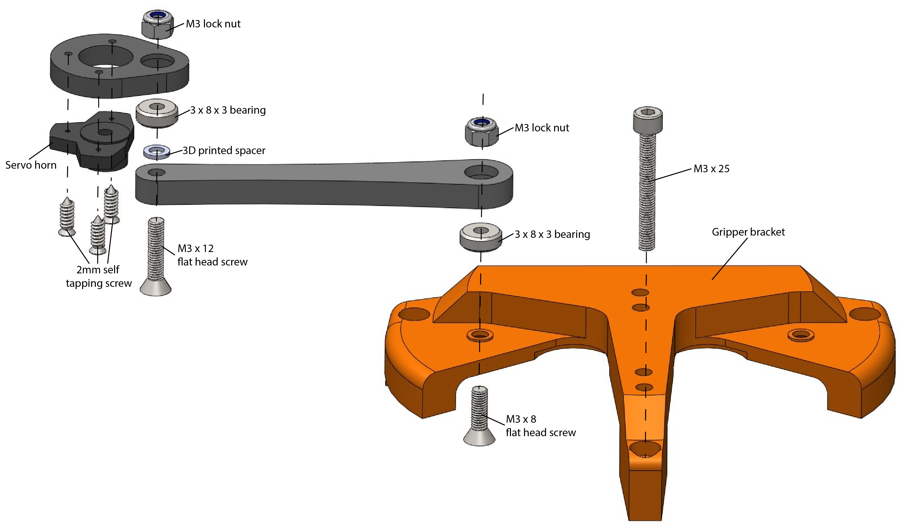

**Note:** Repeat this step for the other side of the bracket 

### 3.2 Attaching the brushless motor to gripper bracket

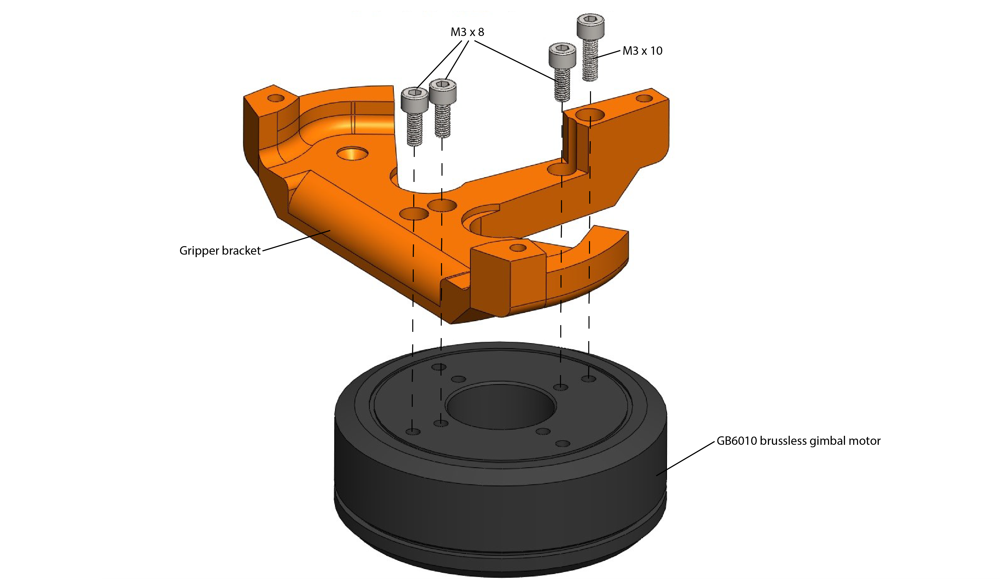

**Note:** Repeat this step again for another bracket

### 3.3 Assembling the palm links

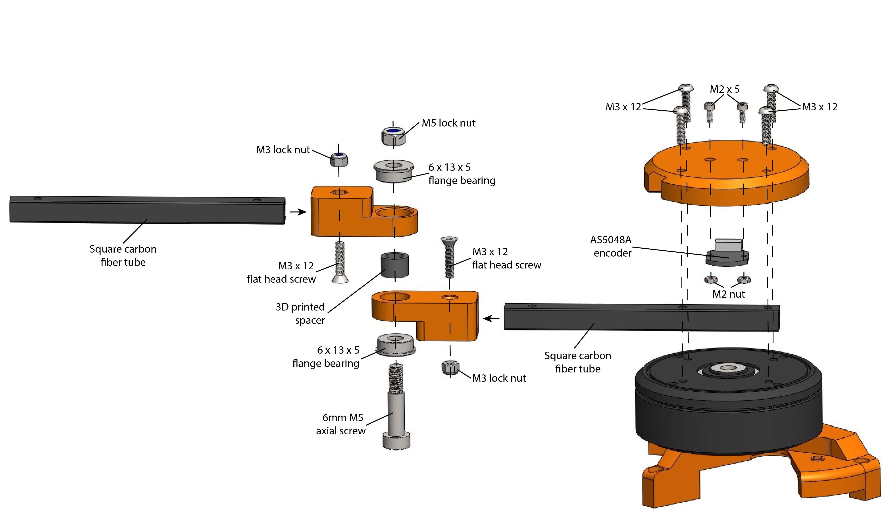

**Note:** Repeat this step again for another bracket

### 3.4 Assembling the palm end-effector

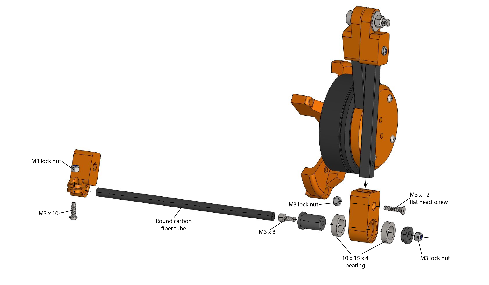

### 3.5 Assembling gripper finger servo

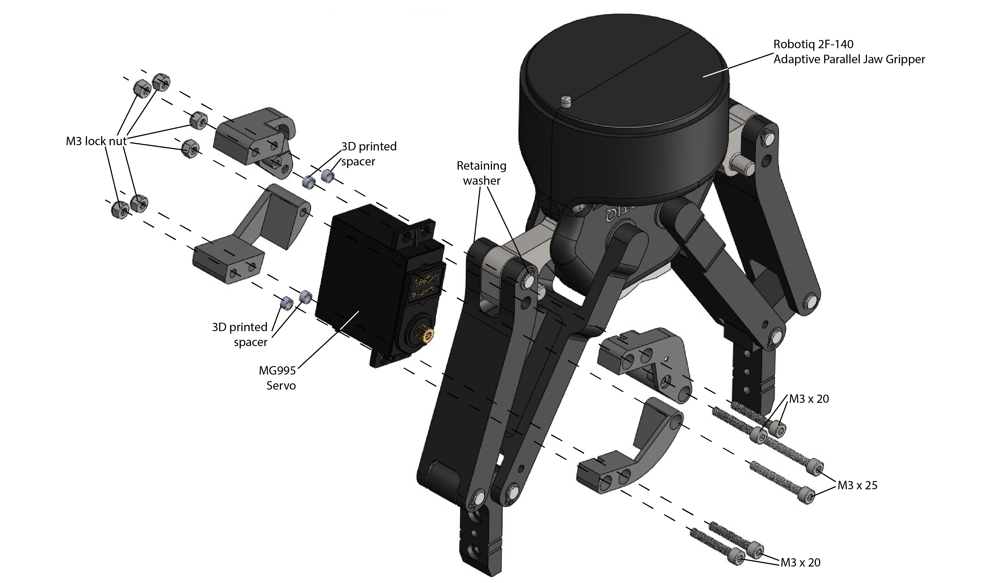

**Note:** Repeat this step for the other finger

### 3.6 Attaching the assembled brackets to the gripper

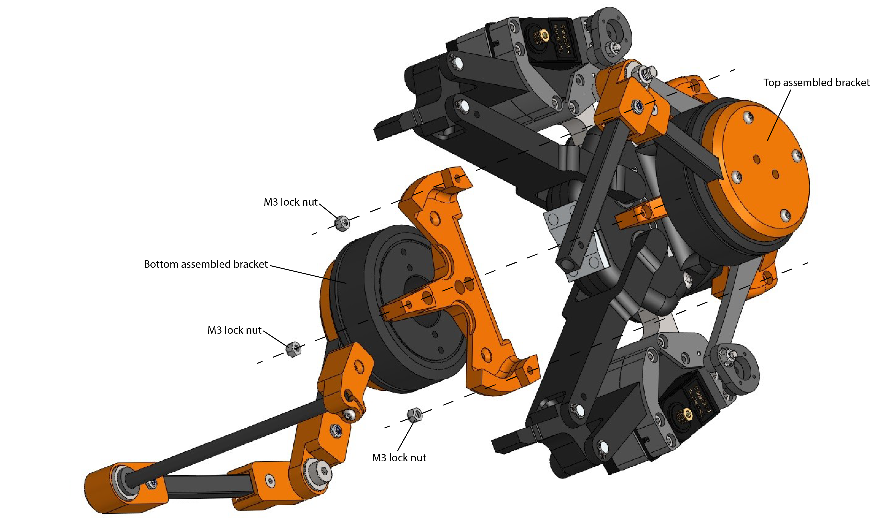

### 3.7 Fastening the gripper brackets

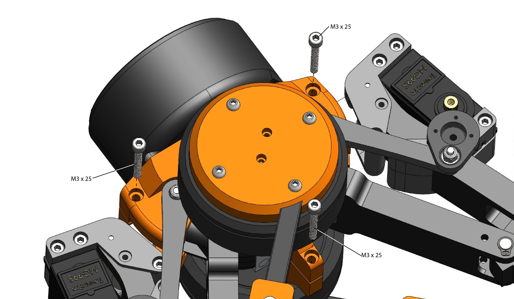

### 3.8 Connecting the palm end-effector

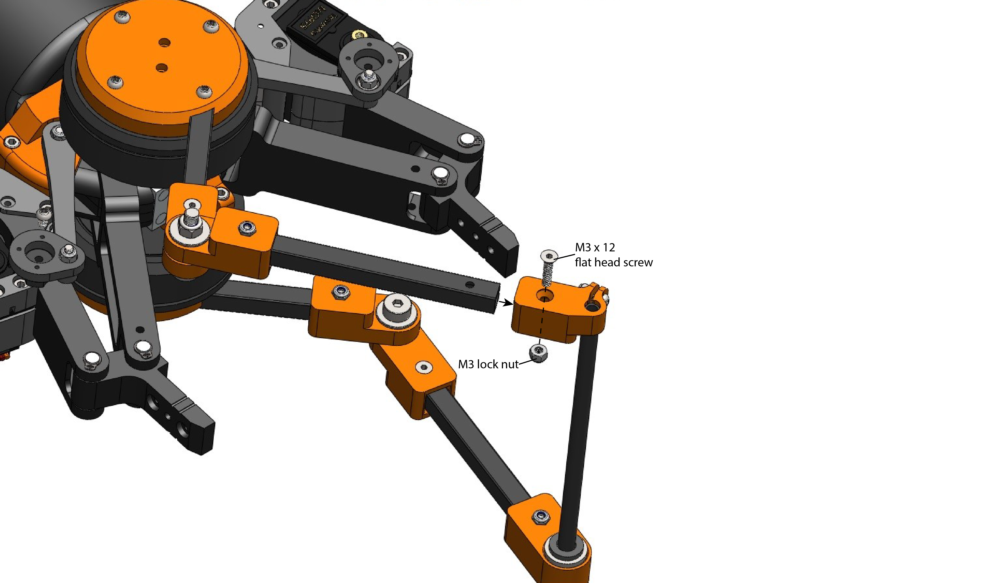

### 3.9 Connecting the finger servo link

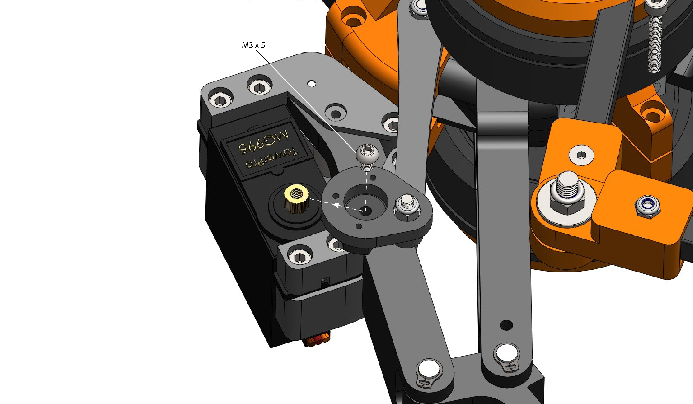

**Note:** Repeat this step for the other finger

## 4. System Schematic

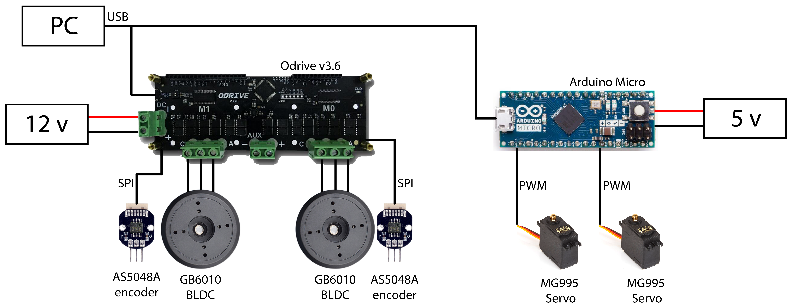

The scripts for controlling the gripper can be found in the folder `/script`, where the .ipynb files are the examples of controlling the gripper.  

## 5. Maintenance
For any technical issues, please contact Ka Hei Mak khmakac@connect.ust.hk