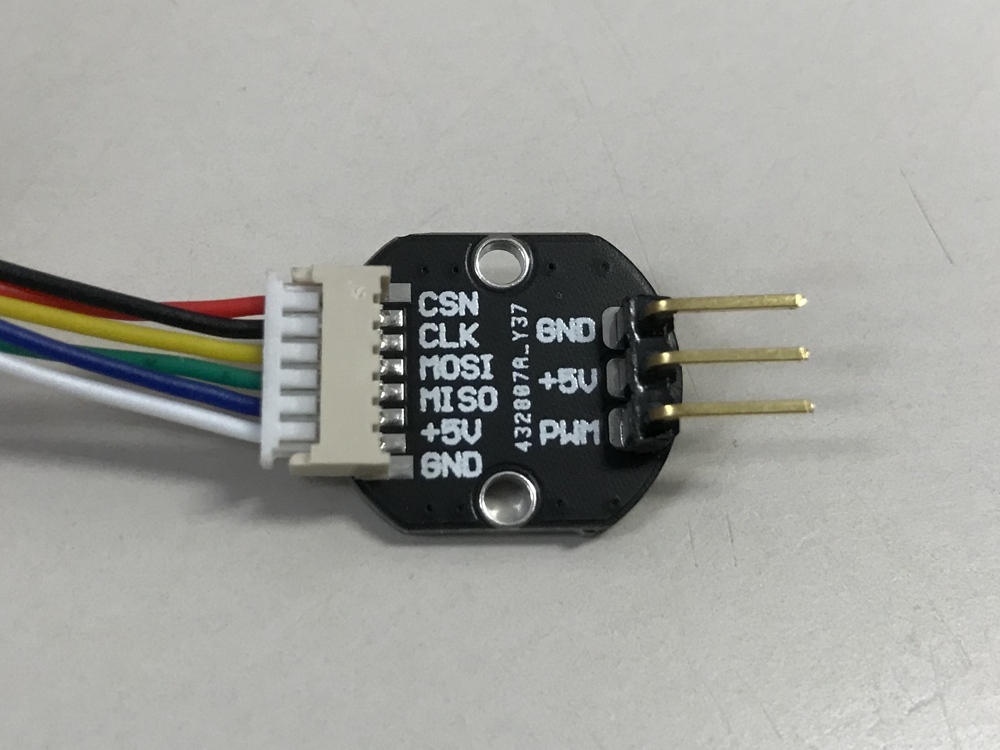

# Parrot Gripper

<p align = "center">

 
</p>


## 1. Overview
The parrot gripper is a robotic end-effector that imitates the parrot's feeding apparatus with a pair of powerful beaks and a soft tongue. This end-effector is implemented by retrofitting an off-the-shelf industrial robotic gripper with customized hardware devices. The tongue (or palm) is a five-bar parallel manipulator that is direct-driven by two brushless gimbal motors, which can achieve force control, virtual compliance, and rapid motion. The beaks (or fingers) are actuated by two servo motors that morphs the adaptive linkages of the gripper.

This repository provides the details of assembling and controlling the parrot gripper.

**Related Patents:**
- K. H. Mak, Z. Yin, and J. Seo, "*System and Method for Robotic In-Hand Manipulation*," (Under preparation).

## 2. Bill of Materials

**CAD Model** (SolidWorks2018 or newer is required)
- [**Version 1.0**](media/ParrotGripperV1.0_SolidWorks2018.zip) (10 Nov. 2021)


**Actuators**
- [**Robotiq 2F-140**](https://robotiq.com/products/2f85-140-adaptive-robot-gripper): Adaptive Parallel Jaw Gripper x 1
- [**GB6010 gimbal motor**](https://www.aliexpress.com/i/10000018036119.html) x 2
- [**MG995 servo motor**](https://www.towerpro.com.tw/product/mg995/) x 2

**Electronics**
- [**ODrive v3.6**](https://odriverobotics.com/): brushless motor controller x 1
- [**AS5048A encoder**](https://ams.com/as5048a) x 2
- [**Arduino Micro**](https://store.arduino.cc/products/arduino-micro) x 1

## 3. Assembly Instructions

#### 3.1 Assembling servo link to gripper bracket
<p align = "center">

</p>

**Note:** Repeat this step for the other side of the bracket. The M3 x 25 screw should be placed into the hole before attaching the motor.

#### 3.2 Attaching the brushless motor to gripper bracket
<p align = "center">

</p>

**Note:** Repeat this step again for another bracket

#### 3.3 Assembling the palm links
<p align = "center">

</p>

**Note:** Repeat this step again for another bracket

#### 3.4 Assembling the palm end-effector
<p align = "center">

</p>

#### 3.5 Assembling gripper finger servo
<p align = "center">

</p>

**Note:** Repeat this step for another finger

#### 3.6 Attaching the assembled brackets to the gripper
<p align = "center">

</p>

#### 3.7 Fastening the gripper brackets
<p align = "center">

</p>

#### 3.8 Connecting the palm end-effector
<p align = "center">

</p>

#### 3.9 Connecting the finger servo link
<p align = "center">

</p>

**Note:** Repeat this step for another finger

## 4. System Schematic
<p align = "center">

</p>

#### 4.1 ODrive Connections
**Connecting the motors through the header to the motor terminals**

<p align = "center">

</p>

**Connecting the encoders to ODrive through SPI interface**
<p align = "center">


</p>

**Note:** The two encoders are identified by the GPIO pin that they connected to. For example, the CSN pin of encoder #1 is connected to GPIO pin 5 and encoder #2 is connection to pin 6.

**USB and power connection**
<p align = "center">

</p>

## 5. Software

#### 5.1 Prerequisites
- Install python3: `sudo apt install python3 python3-pip`
- Install ODrive tool: `sudo pip3 install --upgrade odrive`
- Install urx: `sudo pip install urx`
- Install Jupyter Notebook: `sudo pip3 install jupyter`

#### 5.2 Configuring the ODrive
To configure the ODrive board with the provided config file, run:
```
cd ~/parrot_gripper/odrive
odrivetool restore-config palm_config.json
```
**Note:** If the config file cannot be restored due to mismatched firmware on the ODrive board, you can configure the ODrive through the commands. 
- Start ODrive tool in terminal `odrivetool`.
- Copy the commands in `odrive/palm_config_cmd` and execute them in the terminal.
- Save the configuration by runnung `odrv0.save_configuration()` before turning off the ODrive board.

#### 5.3 Example script
The example script of controlling the parrot gripper can be found in `/script/example.ipynb`. To run the script:
- Start a Jupyter Notebook server in terminal `jupyter notebook`.
- Run `example.ipynb` via the Jupyter Notebook web interface.

## 5. Maintenance
For any technical issues, please contact Ka Hei Mak khmakac@connect.ust.hk
